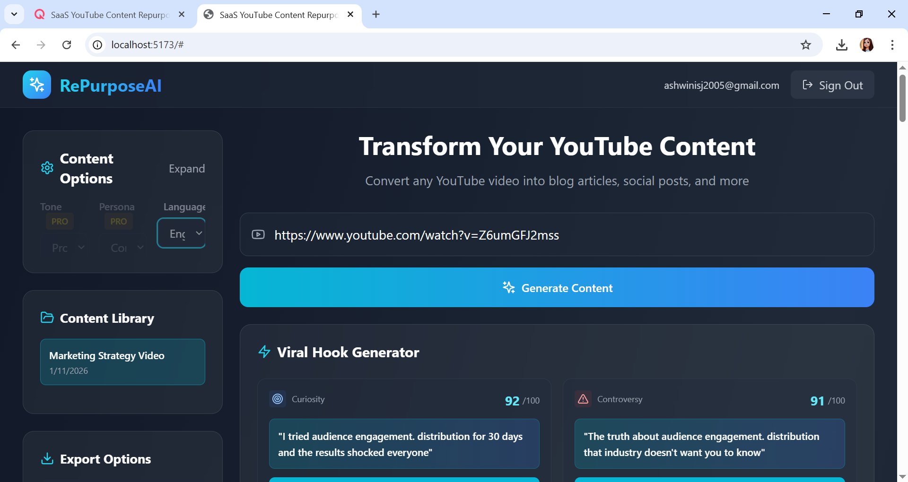
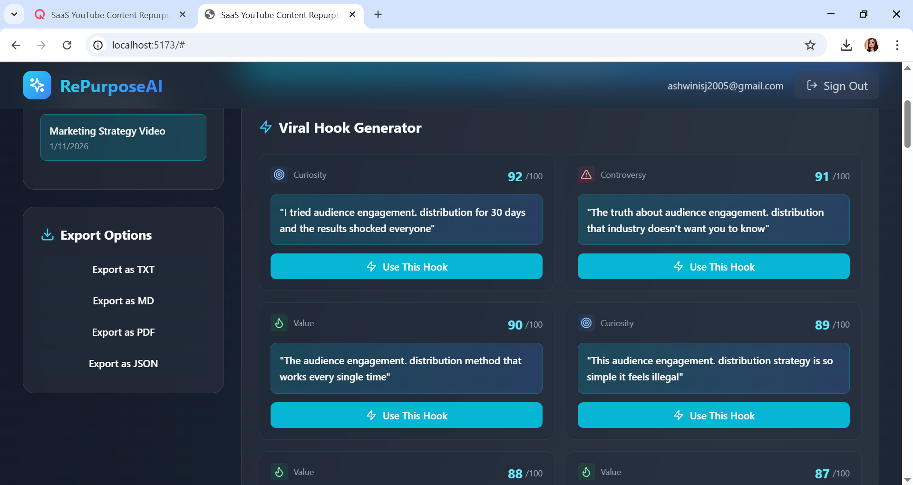
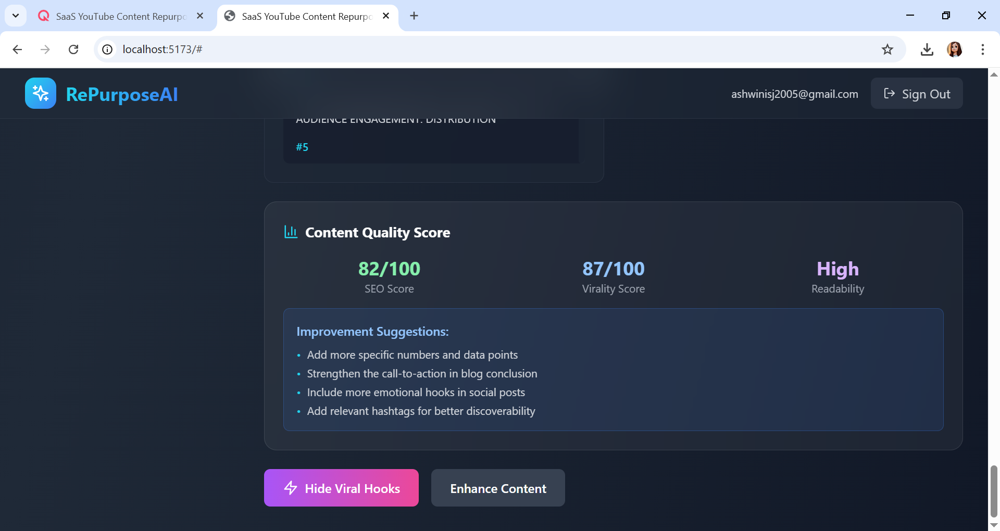

# RePurposeAI ✨

> Transform YouTube videos into multi-platform content with AI-powered intelligence

[](https://reactjs.org/)
[](https://www.typescriptlang.org/)
[](https://tailwindcss.com/)
[](LICENSE)


## 📖 Project Overview

RePurposeAI is an advanced SaaS platform that leverages artificial intelligence to repurpose YouTube video content into multiple formats across various platforms. Simply paste a YouTube URL, and watch as the AI generates blog articles, social media posts, video scripts, viral hooks, and comprehensive analytics—all optimized for maximum engagement.

The platform intelligently analyzes video content through transcripts or metadata, classifies content type, and generates platform-specific content tailored to your audience. Whether you're a content creator, marketer, or business professional, RePurposeAI streamlines your content creation workflow.

## ✨ Features

### Core Capabilities
- 🎯 **Smart Content Analysis** - Automatically extracts and analyzes YouTube video transcripts or metadata
- 📝 **Multi-Format Generation** - Creates blog articles, Instagram posts, LinkedIn content, Twitter threads, and more
- 🎬 **Short Video Scripts** - Generates engaging 30-60 second scripts for TikTok, Reels, and YouTube Shorts
- 🔥 **Viral Hook Generator** - AI-powered hooks optimized for maximum engagement and click-through rates
- 📊 **Content Analytics** - Provides SEO scores, virality potential, readability metrics, and performance insights
- 🌍 **Multi-Language Support** - Generate content in English, Hindi, Hinglish, and Spanish

### Premium Features
- 🎨 **Tone & Persona Controls** - Customize content voice (Professional, Casual, Viral, Educational, Storytelling)
- 👤 **Persona Selection** - Generate content as Founder, Content Creator, Marketer, Teacher, or Influencer
- 📈 **Performance Predictions** - Estimated reach, engagement potential, and best posting times
- 💎 **Quality Scoring** - Real-time content quality assessment with improvement suggestions
- 📚 **Content Library** - Save and organize all your generated projects
- 📥 **Export Options** - Download in TXT, MD, PDF, or JSON formats

### Technical Highlights
- ⚡ **Intelligent Content Classification** - Automatically categorizes content as Entertainment, Education, Business, or Discussion
- 🔄 **Fallback System** - Gracefully handles videos without transcripts using metadata analysis
- 🎭 **Context-Aware Generation** - Adapts content style based on video type and target audience
- 🚀 **Real-time Generation** - Fast AI processing with progress indicators

## 🛠️ Tech Stack

### Frontend
- **React 18.3.1** - Modern UI library with hooks
- **TypeScript 5.5.3** - Type-safe development
- **Tailwind CSS 3.4.1** - Utility-first styling
- **Lucide React** - Beautiful icon system

### Backend Services
- **Supabase** - Authentication and database
- **YouTube Transcript API** - Video content extraction
- **YouTube Data API v3** - Metadata fetching
- **Custom AI Service** - Content generation engine

### Development Tools
- **Vite 5.4.2** - Lightning-fast build tool
- **ESLint** - Code quality enforcement
- **TypeScript ESLint** - TypeScript-specific linting

## 📸 Screenshots & Demo

### Main Dashboard

*Clean, modern interface for content generation*

### Viral Hook Generator

*AI-powered viral hooks with effectiveness scores*

### Content Quality Analytics

*Comprehensive quality metrics and improvement suggestions*


## 🚀 Installation & Setup

### Prerequisites
- Node.js 18.x or higher
- npm or yarn package manager
- Supabase account (for authentication)
- YouTube Data API key (optional, for enhanced metadata)

### Step 1: Clone the Repository
```bash
git clone https://github.com/yourusername/repurposeai.git
cd repurposeai
```

### Step 2: Install Dependencies
```bash
npm install
```

### Step 3: Configure Environment Variables
Create a `.env` file in the root directory:

```env
# Supabase Configuration
VITE_SUPABASE_URL=your_supabase_project_url
VITE_SUPABASE_ANON_KEY=your_supabase_anon_key

# YouTube API (Optional - for enhanced metadata)
VITE_YOUTUBE_API_KEY=your_youtube_api_key
```

### Step 4: Run Development Server
```bash
npm run dev
```

The application will be available at `http://localhost:5173`

### Step 5: Build for Production
```bash
npm run build
npm run preview
```

## 🔐 Environment Variables

| Variable | Required | Description |
|----------|----------|-------------|
| `VITE_SUPABASE_URL` | Yes | Your Supabase project URL |
| `VITE_SUPABASE_ANON_KEY` | Yes | Supabase anonymous/public API key |
| `VITE_YOUTUBE_API_KEY` | No | YouTube Data API v3 key for enhanced metadata fetching |

### Setting up Supabase

1. Create a new project at [supabase.com](https://supabase.com)
2. Navigate to Settings → API
3. Copy your project URL and anon key
4. Create the following table in your Supabase database:

```sql
CREATE TABLE generated_content (
  id UUID DEFAULT uuid_generate_v4() PRIMARY KEY,
  user_id UUID REFERENCES auth.users NOT NULL,
  video_id TEXT NOT NULL,
  video_url TEXT NOT NULL,
  content JSONB NOT NULL,
  created_at TIMESTAMP WITH TIME ZONE DEFAULT NOW()
);
```

## 💡 Usage

### Basic Workflow

1. **Sign Up/Login** - Create an account or sign in to access the dashboard
2. **Enter YouTube URL** - Paste any YouTube video link into the input field
3. **Configure Options** (Optional)
   - Select tone (Professional, Casual, Viral, etc.)
   - Choose persona (Founder, Creator, Marketer, etc.)
   - Pick target platforms
   - Enable short video scripts
   - Toggle analytics
4. **Generate Content** - Click "Generate Content" and wait for AI processing
5. **Review & Export** - Browse generated content, use viral hooks, and export in your preferred format

### Advanced Features

#### Viral Hook Generation
```typescript
// Hooks are automatically generated with effectiveness scores
// Categories: Curiosity, Controversy, Value, Story, Urgency
// Scores range from 0-100 based on engagement potential
```

#### Content Enhancement
- **Make Shorter** - Condense content while maintaining key points
- **More Viral** - Add attention-grabbing elements and formatting
- **Simpler Language** - Reduce complexity for broader audience
- **Add Emojis** - Strategic emoji placement for engagement
- **Carousel Format** - Convert to Instagram carousel structure

#### Multi-Language Content
Select from:
- English (Default)
- Hindi (Full translation)
- Hinglish (Hindi-English mix)
- Spanish

## 🎯 Key Algorithms

### Content Classification
The platform uses keyword frequency analysis to classify content:
```typescript
// Content types: Entertainment, Education, Business, Discussion
// Language detection: English, Hindi, Hinglish, Unknown
// Confidence scoring based on keyword matches
```

### Quality Scoring
Multi-factor analysis including:
- SEO optimization (keyword usage, structure)
- Virality potential (hooks, engagement triggers)
- Readability level (Flesch-Kincaid, sentence complexity)
- Platform optimization (character limits, formatting)

## 🔮 Future Enhancements

- [ ] **AI Model Integration** - Direct integration with GPT-4, Claude, or open-source LLMs
- [ ] **Video Analysis** - Process actual video frames for visual content suggestions
- [ ] **Batch Processing** - Generate content for multiple videos simultaneously
- [ ] **Content Calendar** - Schedule and plan content distribution
- [ ] **Team Collaboration** - Multi-user workspaces with role-based access
- [ ] **A/B Testing** - Compare multiple content variations
- [ ] **Advanced Analytics** - Historical performance tracking and insights
- [ ] **API Access** - RESTful API for third-party integrations
- [ ] **Mobile App** - Native iOS and Android applications
- [ ] **Browser Extension** - Generate content directly from YouTube
- [ ] **WordPress Plugin** - One-click publishing to WordPress blogs
- [ ] **Shopify Integration** - Product description generation from demo videos

## 🤝 Contributing

We welcome contributions from the community! Here's how you can help:

### Reporting Bugs
Open an issue with:
- Clear description of the bug
- Steps to reproduce
- Expected vs actual behavior
- Screenshots (if applicable)
- Environment details (browser, OS, etc.)

### Suggesting Features
Create an issue with:
- Detailed feature description
- Use case explanation
- Potential implementation approach

### Pull Requests
1. Fork the repository
2. Create a feature branch (`git checkout -b feature/AmazingFeature`)
3. Commit your changes (`git commit -m 'Add some AmazingFeature'`)
4. Push to the branch (`git push origin feature/AmazingFeature`)
5. Open a Pull Request

### Development Guidelines
- Follow existing code style and conventions
- Write meaningful commit messages
- Add comments for complex logic
- Update documentation as needed
- Test thoroughly before submitting

## 📄 License

This project is licensed under the MIT License - see the [LICENSE](LICENSE) file for details.

## 🙏 Acknowledgments

- **YouTube Transcript API** - For transcript extraction capabilities
- **Supabase** - For authentication and database infrastructure
- **Tailwind CSS** - For the beautiful UI framework
- **Lucide** - For the comprehensive icon library
- **React Community** - For excellent tooling and ecosystem

## 📧 Contact & Support

- **Email**: support@repurposeai.com
- **Twitter**: [@RePurposeAI](https://twitter.com/repurposeai)
- **Discord**: [Join our community](https://discord.gg/repurposeai)

---

<p align="center">Made with ❤️ by the RePurposeAI Team</p>

<p align="center">
  <a href="#repurposeai-">Back to Top</a>
</p>
